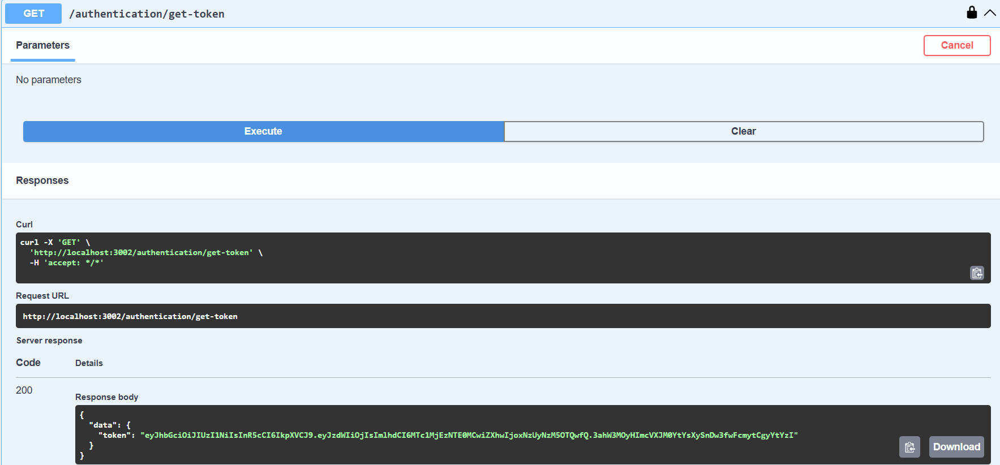
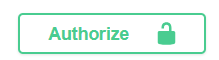
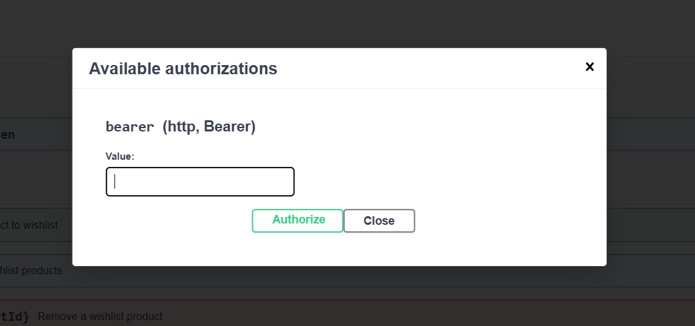

# Backend da Wishlist

<p align="center">
  
</p>

## Visão Geral

O **Wishlist Backend** é um serviço dedicado à gestão de listas de desejos, permitindo que usuários consultem, adicionem ou removam itens de suas listas. Ele foi desenvolvido para integração direta com uma camada BFF (Backend for Frontend), garantindo entrega otimizada de dados para aplicações frontend.

---

## Funcionalidades

- **Gerenciamento de Wishlist**: criar, excluir e listar itens na lista de desejos.
- **Integração com BFF**: entrega de dados otimizada para aplicações frontend.

---

## Tecnologias Utilizadas

- **Framework Backend**: Node.js com NestJS
- **Banco de Dados**: MongoDB
- **API**: RESTful
- **Integração**: Comunicação direta com a camada BFF

---

## Como Iniciar o Projeto

A aplicação utiliza um arquivo `docker-compose.yml` para subir os serviços necessários (NestJS + MongoDB). Execute os seguintes comandos no terminal para iniciar o ambiente:

```bash
docker-compose down
docker-compose build
docker-compose up -d
```

 
## Integração com o BFF

O Wishlist Backend foi projetado para funcionar em conjunto com um BFF (Backend for Frontend), que atua como intermediário entre o frontend e os serviços backend. Essa arquitetura permite adaptar a entrega de dados às necessidades da interface, garantindo melhor desempenho e organização.

## Implementação

A estrutura da aplicação segue boas práticas modernas:

- **Injeção de Dependência (DI)**: gerenciamento de serviços desacoplado.
- **DTOs (Data Transfer Objects)**: estruturação e validação de dados.
- **Pipes**: transformação e validação das entradas.
- **Guards**: controle de acesso aos endpoints.
- **Autenticação com JWT**: proteção de rotas por meio de tokens.
- **Swagger**: documentação automática da API.
- **json-server**: simulação de APIs externas em ambiente de testes.


Para mocks de chamadas http foi utilizado o json-server, que simula o comportamento do backend para as entidades não gerenciadas

## Como utilizar
A documentação Swagger está disponível em (Após iniciar o docker): `http://localhost:3002/swagger-ui`

## API Endpoints
Para reproduzir o uso da aplicação é necessário os seguintes passos:

## Autenticação via Swagger

### 1. Obter token
Execute o endpoint:
Endpoint exemplo: `GET http://localhost:3002/authentication/get-token`

Clique em **"Execute"** e copie o token gerado.


### 2. Autorizar o token
Clique no botão **"Authorize"** no topo da interface Swagger.




Cole o token e confirme. Agora todos os endpoints estarão autenticados e prontos para uso.



## Endpoints Disponíveis

- `GET /wishlist/items`: retorna a wishlist do usuário autenticado.
- `POST /wishlist/items`: adiciona um item à wishlist.
- `DELETE /wishlist/items/:id`: remove um item da wishlist.
- `GET /wishlist/items/:id`: verifica se um item está presente na wishlist.

## Preset de Dados para Testes

- Um usuário com `userId: "2"` é pré-configurado com uma wishlist de **19 itens**.
- Essa lista é criada automaticamente sempre que o container é iniciado.
- Os produtos válidos têm IDs de `1` a `30`.
- Você pode adicionar ou remover itens da lista a qualquer momento.
- O token gerado na autenticação é do usuário com `id: "2"`.


## Informações Adicionais

- Os endpoints funcionam de forma **independente**, não exigem chamadas em ordem.
- Se um produto já está presente na wishlist, o backend **não retorna erro**, apenas ajusta o **status code** adequadamente.
- Erros reais só ocorrem em casos de **falha externa**, como indisponibilidade de serviços HTTP simulados.
.

## Próximos Passos

- 🔧 **Padronizar mensagens de erro**: melhorar clareza e debuggabilidade.
- 🧪 **Adicionar testes unitários**: garantir estabilidade e qualidade do código.
- 🚀 **Melhorar performance**: otimizar interações com o MongoDB.
- 🧬 **Avaliar uso de GraphQL**: fornecer queries mais flexíveis no futuro.
